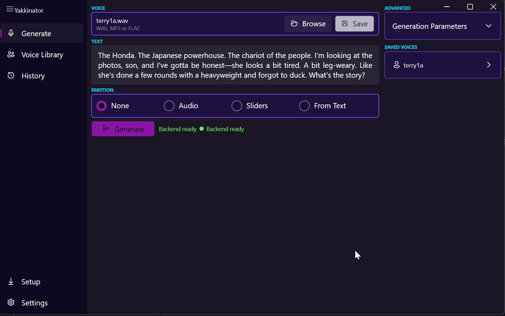

# The Yakkinator 🤖

> A retro-futuristic Text-to-Speech studio powered by IndexTTS-2. Point it at a voice sample, type your words, and let The Yakkinator do the talking.

---

## Yakkinator in Action 🎬



---

## Quick Start ⚡

**One-click setup!** Just double-click `TheYakkinator.exe` and you're off to the races.

> **💾 Heads up:** The first run downloads ~16GB of model files to your `%LOCALAPPDATA%` folder. It's a one-time download — future launches are instant! Coffee break recommended on first run. ☕

---

## Prerequisites

### 1. Python 3.10 or later
Download from [python.org](https://www.python.org/downloads/).
During installation, check **"Add Python to PATH"**.

Verify:
```
python --version
```

### 2. CUDA Toolkit (NVIDIA GPU recommended)
IndexTTS-2 runs significantly faster on a CUDA-capable GPU.

- Download CUDA 11.8 or 12.x from [developer.nvidia.com/cuda-downloads](https://developer.nvidia.com/cuda-downloads)
- CPU-only mode works but is slow

### 3. IndexTTS Python Package
Open a terminal and run:
```
pip install indextts
```

Or for GPU support with a specific torch version:
```
pip install torch torchvision torchaudio --index-url https://download.pytorch.org/whl/cu118
pip install indextts
```

### 4. FastAPI & Uvicorn
```
pip install fastapi uvicorn
```

### 5. IndexTTS-2 Model Checkpoints
Download the model files from Hugging Face:
[IndexTeam/IndexTTS-2](https://huggingface.co/IndexTeam/IndexTTS-2)

Place the downloaded files in a folder called `checkpoints` next to the app:
```
TheYakkinator/
├── TheYakkinator.exe
├── checkpoints/
│   ├── config.yaml
│   └── ... (model files)
```

### 6. .NET 8 Runtime (if not using the self-contained build)
Download from [dotnet.microsoft.com](https://dotnet.microsoft.com/download/dotnet/8.0).

---

## Running The Yakkinator 🚀

1. **Double-click** `TheYakkinator.exe` — sit back, relax, maybe grab a snack
2. **Watch the magic** — the app auto-starts the Python backend (first run takes a few minutes)
3. **Pick a voice** — drop in any WAV/MP3 file to clone its style
4. **Type & Create** — enter your text and hit Generate. Let the yakking begin!

---

## Troubleshooting 🛠️

| Problem | Fix |
|---|---|
| `python not found` | Re-install Python and check "Add to PATH" |
| `indextts not found` | Run `pip install indextts` in terminal |
| Slow generation | Enable GPU — install CUDA and the matching torch version |
| Model not found | Ensure `checkpoints/config.yaml` exists next to the .exe |

---

**Need help?** Open an issue on GitHub and we'll get you yakking in no time! 🎙️
